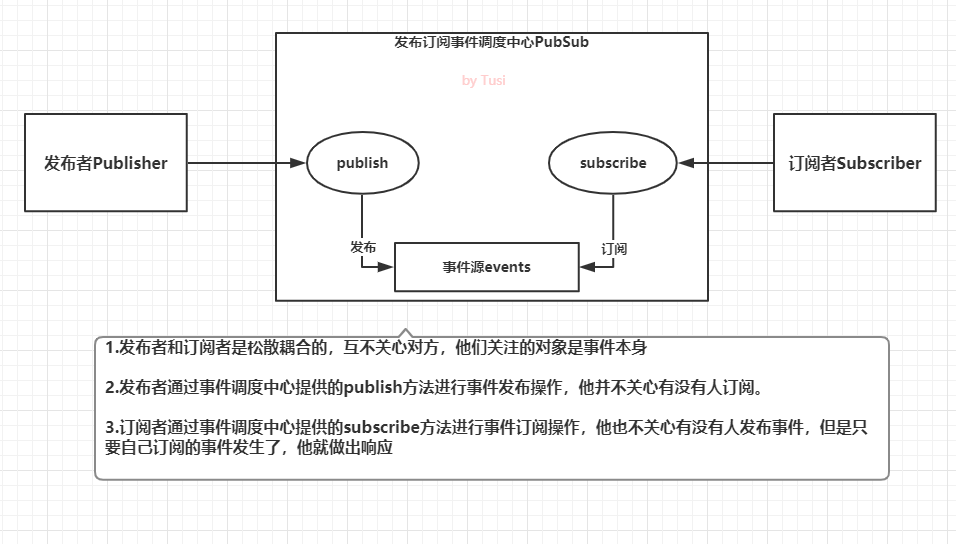

# 观察者模式（Observer mode）


## 定义

观察者模式与发布订阅模式相比，耦合度更高，通常用来实现一些响应式的效果

在观察者模式中，只有两个主体，分别是目标对象`Subject`，观察者`Observer`

- 观察者 `Observer` 要实现 `update` 方法，供目标对象调用。`update`方法中可以执行自定义的业务代码
- 目标对象`Subject`也通常被叫做被观察者或主题
  `Subject`需要维护自身的观察者数组`observerList`，当自身发生变化时，通过调用自身的`notify`方法，依次通知每一个观察者执行`update`方法

### 优点

- 角色很明确，没有事件调度中心作为中间者，目标对象`Subject`和观察者`Observer`都要实现约定的成员方法。
- 双方联系更紧密，目标对象的主动性很强，自己收集和维护观察者，并在状态变化时主动通知观察者更新

### 缺点

耦合度太高

## 原生实现

```js
// 观察者
class Observer {
    //cb 回调函数，收到目标对象通知时执行
    constructor(cb){
        if (typeof cb === 'function') {
            this.cb = cb
        } else {
            throw new Error('Observer构造器必须传入函数类型！')
        }
    }
    //被目标对象通知时执行
    update() {
        this.cb()
    }
}

// 目标对象
class Subject {
    constructor() {
        // 维护观察者列表
        this.observerList = []
    }
    //添加一个观察者
    addObserver(observer) {
        this.observerList.push(observer)
    }
    //通知所有的观察者
    notify() {
        this.observerList.forEach(observer => {
            observer.update()
        })
    }
}

const observerCallback = function() {
    console.log('我被通知了')
}
const observer = new Observer(observerCallback)

const subject = new Subject();
subject.addObserver(observer);
subject.notify();

```

## 利用 Proxy 实现

```js
const queuedObservers = new Set();

const observe = fn => queuedObservers.add(fn);
const observable = obj => new Proxy(obj, {set});

function set(target, key, value, receiver) {
  const result = Reflect.set(target, key, value, receiver);
  queuedObservers.forEach(observer => observer());
  return result;
}

const person = observable({
  name: '张三',
  age: 20
});

function print() {
  console.log(`${person.name}, ${person.age}`)
}

observe(print);
person.name = '李四';
```


# 发布订阅模式



## 区别

发布订阅模式 是基于 观察者模式的，区别在于 发布订阅模式 多了事件处理中心的概念

在观察者模式中，观察者需要直接订阅目标事件；在目标发出内容改变的事件后，直接接收事件并作出响应

在发布订阅模式中，发布者和订阅者之间多了一个发布通道

一方面从发布者接收事件，另一方面向订阅者发布事件；订阅者需要从事件通道订阅事件

这样发布者和订阅者是松散耦合的

以此避免发布者和订阅者之间产生依赖关系

## 缺点

当事件类型越来越多时，难以维护，需要考虑事件命名的规范，也要防范数据流混乱

## 原生实现

```
class PubSub {
    constructor() {
        // 维护事件及订阅行为
        this.events = {}
    }
    //注册事件订阅行为
    subscribe(type, cb) {
        if (!this.events[type]) {
            this.events[type] = []
        }
        this.events[type].push(cb)
    }
    //发布事件
    publish(type, ...args) {
        if (this.events[type]) {
            this.events[type].forEach(cb => {
                cb(...args)
            })
        }
    }
    //移除某个事件的一个订阅行为
    unsubscribe(type, cb) {
        if (this.events[type]) {
            const targetIndex = this.events[type].findIndex(item => item === cb)
            if (targetIndex !== -1) {
                this.events[type].splice(targetIndex, 1)
            }
            if (this.events[type].length === 0) {
                delete this.events[type]
            }
        }
    }
    //移除某个事件的所有订阅行为
    unsubscribeAll(type) {
        if (this.events[type]) {
            delete this.events[type]
        }
    }
}
```


## EventEmitter实现

```
class EventEmitter {
    constructor() {
        // 维护事件及监听者
        this.listeners = {}
    }
    /**
     * 注册事件监听者
     * @param {String} type 事件类型
     * @param {Function} cb 回调函数
     */
    on(type, cb) {
        if (!this.listeners[type]) {
            this.listeners[type] = []
        }
        this.listeners[type].push(cb)
    }
    /**
     * 发布事件
     * @param {String} type 事件类型
     * @param  {...any} args 参数列表，把emit传递的参数赋给回调函数
     */
    emit(type, ...args) {
        if (this.listeners[type]) {
            this.listeners[type].forEach(cb => {
                cb(...args)
            })
        }
    }
    /**
     * 移除某个事件的一个监听者
     * @param {String} type 事件类型
     * @param {Function} cb 回调函数
     */
    off(type, cb) {
        if (this.listeners[type]) {
            const targetIndex = this.listeners[type].findIndex(item => item === cb)
            if (targetIndex !== -1) {
                this.listeners[type].splice(targetIndex, 1)
            }
            if (this.listeners[type].length === 0) {
                delete this.listeners[type]
            }
        }
    }
    /**
     * 移除某个事件的所有监听者
     * @param {String} type 事件类型
     */
    offAll(type) {
        if (this.listeners[type]) {
            delete this.listeners[type]
        }
    }
}
// 创建事件管理器实例
const ee = new EventEmitter()
// 注册一个chifan事件监听者
ee.on('chifan', function() { console.log('吃饭了，我们走！') })
// 发布事件chifan
ee.emit('chifan')
// 也可以emit传递参数
ee.on('chifan', function(address, food) { console.log(`吃饭了，我们去${address}吃${food}！`) })
ee.emit('chifan', '三食堂', '铁板饭') // 此时会打印两条信息，因为前面注册了两个chifan事件的监听者

// 测试移除事件监听
const toBeRemovedListener = function() { console.log('我是一个可以被移除的监听者') }
ee.on('testoff', toBeRemovedListener)
ee.emit('testoff')
ee.off('testoff', toBeRemovedListener)
ee.emit('testoff') // 此时事件监听已经被移除，不会再有console.log打印出来了

// 测试移除chifan的所有事件监听
ee.offAll('chifan')
console.log(ee) // 此时可以看到ee.listeners已经变成空对象了，再emit发送chifan事件也不会有反应了
```


