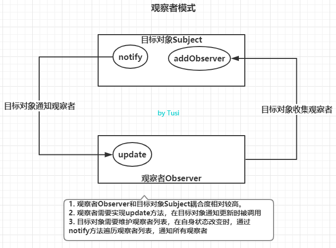

# 观察者模式（Observer mode）



## 定义

观察者模式与发布订阅模式相比，耦合度更高，通常用来实现一些响应式的效果

在观察者模式中，只有两个主体，分别是目标对象`Subject`，观察者`Observer`

- 观察者 `Observer` 要实现 `update` 方法，供目标对象调用。`update`方法中可以执行自定义的业务代码
- 目标对象`Subject`也通常被叫做被观察者或主题
  `Subject`需要维护自身的观察者数组`observerList`，当自身发生变化时，通过调用自身的`notify`方法，依次通知每一个观察者执行`update`方法

### 优点

- 角色很明确，没有事件调度中心作为中间者，目标对象`Subject`和观察者`Observer`都要实现约定的成员方法。
- 双方联系更紧密，目标对象的主动性很强，自己收集和维护观察者，并在状态变化时主动通知观察者更新

### 缺点

耦合度太高

## 原生实现

```js
// 观察者
class Observer {
    //cb 回调函数，收到目标对象通知时执行
    constructor(cb){
        if (typeof cb === 'function') {
            this.cb = cb
        } else {
            throw new Error('Observer构造器必须传入函数类型！')
        }
    }
    //被目标对象通知时执行
    update() {
        this.cb()
    }
}

// 目标对象
class Subject {
    constructor() {
        // 维护观察者列表
        this.observerList = []
    }
    //添加一个观察者
    addObserver(observer) {
        this.observerList.push(observer)
    }
    //通知所有的观察者
    notify() {
        this.observerList.forEach(observer => {
            observer.update()
        })
    }
}

const observerCallback = function() {
    console.log('我被通知了')
}
const observer = new Observer(observerCallback)

const subject = new Subject();
subject.addObserver(observer);
subject.notify();

```

## 利用 Proxy 实现

```js
const queuedObservers = new Set();

const observe = fn => queuedObservers.add(fn);
const observable = obj => new Proxy(obj, {set});

function set(target, key, value, receiver) {
  const result = Reflect.set(target, key, value, receiver);
  queuedObservers.forEach(observer => observer());
  return result;
}

const person = observable({
  name: '张三',
  age: 20
});

function print() {
  console.log(`${person.name}, ${person.age}`)
}

observe(print);
person.name = '李四';
```


